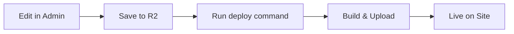

# 🎛️ Admin Panel - Інструкція користувача

## 📋 Зміст

### Для менеджерів

1. [Швидкий старт](#швидкий-старт)
2. [Вхід в систему](#вхід-в-систему)
3. [Dashboard - Головна сторінка](#dashboard---головна-сторінка)
4. [Партнери - Управління партнерами](#партнери---управління-партнерами)
5. [Категорії - Управління категоріями](#категорії---управління-категоріями)
6. [Локації - Управління локаціями](#локації---управління-локаціями)
7. [FAQ - Управління питаннями](#faq---управління-питаннями)
8. [Тексти - Редагування текстів](#тексти---редагування-текстів)
9. [Зображення - Управління зображеннями](#зображення---управління-зображеннями)
10. [Налаштування - Загальні налаштування](#налаштування---загальні-налаштування)
11. [Користувачі - Управління доступом](#користувачі---управління-доступом)
12. [Публікація змін](#публікація-змін)

### Для розробників

- [Технічна документація](#технічна-документація-для-розробників)
- [Архітектура](#архітектура-админки)
- [API інтеграція](#api-інтеграція)
- [Деплой](#деплой)

---

## 🚀 Швидкий старт

### Що таке Admin Panel?

Admin Panel — це інструмент для управління контентом сайту **Corporate Discounts**. Тут ви можете:

- ✅ Додавати, редагувати та видаляти партнерів
- ✅ Керувати категоріями та локаціями
- ✅ Оновлювати FAQ
- ✅ Редагувати тексти на сайті
- ✅ Змінювати зображення
- ✅ Керувати доступом користувачів
- ✅ Публікувати зміни на сайт

### Хто має доступ?

Доступ до Admin Panel мають тільки співробітники UPSTARS, які додані до списку дозволених користувачів. Для входу використовується **Google акаунт** вашої корпоративної пошти.

### Як отримати доступ?

Зверніться до адміністратора системи, щоб вас додали до списку користувачів.

---

## 🔐 Вхід в систему

### Крок 1: Відкрийте Admin Panel

Перейдіть за адресою:

```
https://discounts.upstars.com/admin
```

### Крок 2: Авторизуйтеся через Google

1. Натисніть кнопку **"Sign in with Google"**
2. Виберіть ваш корпоративний Google акаунт
3. Дозвольте доступ до профілю

### Крок 3: Перейдіть до Dashboard

Після успішної авторизації ви потрапите на головну сторінку (Dashboard).

---

## 📊 Dashboard - Головна сторінка

Dashboard показує загальну статистику та швидкий доступ до основних функцій.

### Що ви побачите:

#### 1. Статистика

- **55 Партнерів** — загальна кількість партнерів на сайті
- **9 Категорій** — кількість категорій для фільтрації
- **3 Локації** — доступні локації
- **7 FAQ питань** — кількість питань в розділі FAQ

#### 2. Швидкі дії

- **+ Додати партнера** — швидке створення нового партнера
- **Відкрити сайт** — перегляд публічного сайту в новій вкладці

#### 3. Експорт і деплой

Панель для збереження змін та публікації їх на сайт:

- **Експорт в файл** — завантажити всі дані у форматі JSON
- **Завантажити з R2** — синхронізувати дані з сервером
- **Зберегти на R2** — зберегти зміни на сервер

> **⚠️ Важливо:** Після збереження на R2 потрібно запустити деплой для оновлення сайту!

---

## 🤝 Партнери - Управління партнерами

Розділ для управління всіма партнерами та їхніми пропозиціями.

### Огляд розділу

У вас є:

- **Таблиця партнерів** з фото, назвою, категорією, локацією, промокодом та знижкою
- **Пошук** за назвою, slug або промокодом
- **Фільтри** за категорією та локацією
- **Дії** для кожного партнера

---

### 📝 Додати нового партнера

#### Крок 1: Натисніть "Додати партнера"

Кнопка знаходиться у правому верхньому куті.

#### Крок 2: Заповніть основну інформацію

**Обов'язкові поля:**

- **Назва (UA)** — назва партнера українською (наприклад, "Roślynka")
- **Назва (EN)** — назва англійською (наприклад, "Roslynka")
- **Slug** — генерується автоматично з англійської назви (наприклад, "roslynka")
- **Промокод** — код знижки для користувачів (наприклад, "UPSTARS10")

**Додаткові поля:**

- **Категорія (UA/EN)** — виберіть зі списку (Воркшоп, Здоров'я, Їжа, тощо)
- **Локація (UA/EN)** — виберіть локацію (UA/Київ, UA/Львів, UA/Онлайн, тощо)

#### Крок 3: Додайте деталі знижки

- **Розмір знижки (UA)** — наприклад, "-10%" або "Знижка 500 грн"
- **Розмір знижки (EN)** — англійський варіант

#### Крок 4: Додайте описи

- **Короткий опис (UA/EN)** — 1-2 речення про партнера
- **Повний опис (UA/EN)** — детальний опис послуг/товарів

#### Крок 5: Контакти

- **Вебсайт** — URL сайту партнера (наприклад, "https://roslynka.com")
- **Email** — контактна пошта
- **Телефон** — номер телефону
- **Зображення (URL)** — шлях до фото (генерується автоматично: `/images/partners/slug.webp`)

#### Крок 6: Соціальні мережі

- **Facebook** — посилання на Facebook сторінку
- **Instagram** — посилання на Instagram профіль

#### Крок 7: Адреса та умови

- **Адреса (UA/EN)** — фізична адреса (для офлайн партнерів)
- **Умови (UA/EN)** — список умов використання знижки
  - Натисніть **"+ Додати"** для додавання нових умов
  - Натисніть **"×"** для видалення умови

#### Крок 8: Збережіть

Натисніть кнопку **"Створити партнера"**.

> **💡 Підказка:** Slug генерується автоматично при введенні англійської назви і не може бути змінений після створення.

---

### ✏️ Редагувати партнера

1. Знайдіть партнера в таблиці (використовуйте пошук або фільтри)
2. Натисніть іконку **"✏️ Редагувати"** в колонці "Дії"
3. Змініть потрібні поля
4. Натисніть **"Зберегти зміни"**

> **⚠️ Увага:** Slug партнера не можна змінити після створення!

---

### 📋 Копіювати JSON партнера

Якщо потрібно скопіювати дані партнера для бекапу або дебагу:

1. Натисніть іконку **"📋 Копіювати JSON"**
2. Дані партнера будуть скопійовані в буфер обміну

---

### 🔄 Дублювати партнера

Якщо потрібно створити схожого партнера:

1. Натисніть іконку **"🔄 Дублювати"**
2. Система створить копію з додаванням "(копія)" до назви
3. Відредагуйте нового партнера за потреби

---

### 🗑️ Видалити партнера

1. Натисніть іконку **"🗑️ Видалити"**
2. Підтвердіть видалення в модальному вікні
3. Партнер буде видалений з бази даних

> **⚠️ Увага:** Видалення незворотнє! Переконайтеся, що видаляєте правильного партнера.

---

### 🔍 Пошук і фільтрація

#### Пошук

Введіть у поле пошуку:

- Назву партнера (українською або англійською)
- Slug
- Промокод

Результати оновлюються автоматично.

#### Фільтри

**За категорією:**

- Виберіть категорію зі списку (Воркшоп, Здоров'я, Їжа, тощо)
- Показуватимуться тільки партнери цієї категорії

**За локацією:**

- Виберіть локацію (UA/Київ, UA/Львів, UA/Онлайн, тощо)
- Показуватимуться тільки партнери з цієї локації

**Скинути фільтри:**

- Виберіть "Всі категорії" та "Всі локації"

---

### 📥 Експорт партнерів

Для збереження списку всіх партнерів у JSON:

1. Натисніть кнопку **"Експорт JSON"**
2. Файл `partners-export.json` буде завантажено на ваш комп'ютер

---

## 🏷️ Категорії - Управління категоріями

Розділ для управління категоріями партнерів.

### Що таке категорії?

Категорії використовуються для фільтрації партнерів на сайті. Наприклад:

- Воркшоп
- Здоров'я
- Їжа
- Магазин
- Фітнес-клуб

### Системні категорії

**⚠️ Важливо:** Деякі категорії позначені як **"Системна"** і не можуть бути видалені:

- **all** — показує всіх партнерів
- **online** — партнери з онлайн послугами

---

### ➕ Додати категорію

1. Натисніть кнопку **"+ Додати категорію"**
2. Заповніть поля:
   - **ID (slug)** — унікальний ідентифікатор (наприклад, "workshop", "health")
   - **Назва (UA)** — назва українською (наприклад, "Воркшоп")
   - **Назва (EN)** — назва англійською (наприклад, "Workshop")
   - **Опис (UA)** — короткий опис категорії (опціонально)
   - **Опис (EN)** — англійський опис (опціонально)
3. Натисніть **"Створити"**

> **💡 Підказка:** ID генерується автоматично з англійської назви, якщо не вказано вручну.

---

### ✏️ Редагувати категорію

1. Знайдіть категорію в таблиці
2. Натисніть іконку **"✏️ Редагувати"**
3. Змініть потрібні поля
4. Натисніть **"Зберегти"**

> **⚠️ Увага:** ID категорії не можна змінити після створення!

---

### 🗑️ Видалити категорію

1. Натисніть іконку **"🗑️ Видалити"** (доступна тільки для не-системних категорій)
2. Підтвердіть видалення
3. Категорія буде видалена

> **⚠️ Увага:** Перед видаленням переконайтеся, що жоден партнер не використовує цю категорію!

---

### 🔍 Пошук категорій

Введіть у поле пошуку назву або ID категорії для швидкого знаходження.

---

### 📥 Експорт категорій

Натисніть **"Експорт JSON"** для завантаження всіх категорій у форматі JSON.

---

## 📍 Локації - Управління локаціями

Розділ для управління локаціями партнерів.

### Що таке локації?

Локації використовуються для фільтрації партнерів за географічним розташуванням:

- UA (Вся Україна)
- UA/Київ
- UA/Львів
- UA/Онлайн
- PL/Варшава
- LT/Рига

### Системні локації

**⚠️ Важливо:** Деякі локації позначені як **"Системна"** і не можуть бути видалені:

- **all** — показує партнерів з усіх локацій
- **online** — онлайн партнери

---

### ➕ Додати локацію

1. Натисніть кнопку **"+ Додати локацію"**
2. Заповніть поля:
   - **ID (slug)** — унікальний ідентифікатор (наприклад, "ua-kyiv", "pl-warsaw")
   - **Назва (UA)** — назва українською (наприклад, "UA/Київ")
   - **Назва (EN)** — назва англійською (наприклад, "UA/Kyiv")
   - **Опис (UA)** — короткий опис локації (опціонально)
   - **Опис (EN)** — англійський опис (опціонально)
3. Натисніть **"Створити"**

---

### ✏️ Редагувати локацію

1. Знайдіть локацію в таблиці
2. Натисніть іконку **"✏️ Редагувати"**
3. Змініть потрібні поля
4. Натисніть **"Зберегти"**

---

### 🗑️ Видалити локацію

1. Натисніть іконку **"🗑️ Видалити"** (доступна тільки для не-системних локацій)
2. Підтвердіть видалення
3. Локація буде видалена

> **⚠️ Увага:** Перед видаленням переконайтеся, що жоден партнер не використовує цю локацію!

---

### 🔍 Пошук локацій

Введіть у поле пошуку назву або ID локації для швидкого знаходження.

---

### 📥 Експорт локацій

Натисніть **"Експорт JSON"** для завантаження всіх локацій у форматі JSON.

---

## ❓ FAQ - Управління питаннями

Розділ для управління часто задаваними питаннями на сайті.

### Структура FAQ

Кожне питання містить:

- **Категорію** — Загальні, Промокоди, Каталог, Підтримка
- **Питання** — текст питання (UA/EN)
- **Відповідь** — текст відповіді (UA/EN)
- **Порядок** — позиція в списку

---

### ➕ Додати питання

1. Натисніть кнопку **"+ Додати питання"**
2. Заповніть форму:
   - **Категорія** — виберіть зі списку
   - **Питання (UA)** — текст питання українською
   - **Питання (EN)** — текст питання англійською
   - **Відповідь (UA)** — відповідь українською
   - **Відповідь (EN)** — відповідь англійською
3. Натисніть **"Створити"**

Нове питання з'явиться в кінці списку.

---

### ✏️ Редагувати питання

1. Знайдіть питання в списку
2. Натисніть іконку **"✏️ Редагувати"**
3. Змініть потрібні поля
4. Натисніть **"Зберегти"**

---

### 🔄 Змінити порядок питань

Кожне питання має кнопки **"↑ Вгору"** та **"↓ Вниз"**:

1. Натисніть **"↑"** для переміщення питання вище
2. Натисніть **"↓"** для переміщення питання нижче
3. Порядок оновиться автоматично

> **💡 Підказка:** Перше питання не можна підняти вище, останнє — опустити нижче.

---

### 🗑️ Видалити питання

1. Натисніть іконку **"🗑️ Видалити"**
2. Підтвердіть видалення
3. Питання буде видалене

---

### 🔍 Пошук і фільтрація

**Пошук:**

- Введіть текст для пошуку в питаннях або відповідях

**Фільтр за категорією:**

- Виберіть категорію зі списку (Загальні, Промокоди, Каталог, Підтримка)
- Показуватимуться тільки питання з цієї категорії

---

### 📥 Експорт FAQ

Натисніть **"Експорт JSON"** для завантаження всіх питань у форматі JSON.

---

## 📝 Тексти - Редагування текстів

Розділ для редагування всіх текстів на сайті.

### Що можна редагувати?

У системі є **75 текстових ключів**, які використовуються на різних сторінках:

- Заголовки
- Описи
- Кнопки
- Повідомлення
- Placeholder тексти
- Accessibility тексти

### Категорії текстів

Тексти згруповані за категоріями:

- **Сторінка каталогу** — тексти на головній сторінці з партнерами
- **Сторінка деталей** — тексти на сторінці окремого партнера
- **Сторінка FAQ** — тексти на сторінці питань
- **Авторизація** — тексти форми логіну
- **Навігація** — меню та навігаційні елементи
- **Фільтри** — тексти фільтрів
- **Пагінація** — тексти пагінації

---

### ✏️ Редагувати текст

1. **Знайдіть потрібний текст:**
   - Використовуйте пошук (за текстом або ключем)
   - Або виберіть категорію зі списку

2. **Відкрийте форму редагування:**
   - Натисніть іконку **"✏️ Редагувати"**

3. **Змініть тексти:**
   - **Ключ** — показує технічний ідентифікатор (не можна змінити)
   - **Текст (UA)** — редагуйте український варіант
   - **Текст (EN)** — редагуйте англійський варіант

4. **Збережіть зміни:**
   - Натисніть **"Зберегти"**

---

### 🔍 Пошук текстів

Введіть у поле пошуку:

- Частину тексту (українською або англійською)
- Технічний ключ (наприклад, "pages.discounts.title")

Результати фільтруються автоматично.

---

### 📋 Фільтр за категорією

Виберіть категорію зі списку для перегляду текстів тільки з цієї категорії.

---

### 📥 Експорт текстів

Натисніть **"Експорт JSON"** для завантаження всіх текстів у форматі JSON.

> **💡 Підказка:** Будьте уважні при редагуванні! Неправильний текст може порушити UX сайту.

---

## 🖼️ Зображення - Управління зображеннями

Розділ для управління зображеннями на сайті.

### Доступні зображення

У системі є **5 основних зображень**:

#### Логотипи

1. **Логотип (темний)** — `/images/upstars-logo-dark.svg`
2. **Логотип (світлий)** — `/images/upstars-logo-light.svg`

#### Загальні зображення

3. **Тегляйн** — `/images/corporate-discounts-text.svg`
4. **Фон логіну** — `/images/login-background.svg`
5. **Бот-зображення** — `/images/bot-img.svg`

---

### ✏️ Змінити шлях до зображення

1. Знайдіть потрібне зображення в списку
2. Натисніть іконку **"✏️ Редагувати"**
3. Введіть новий шлях до зображення
4. Натисніть **"✓"** для збереження або **"×"** для скасування

> **💡 Підказка:** Шлях до зображення має починатися з `/images/`

---

### 📤 Завантаження нових зображень

**⚠️ Важливо:** Самі зображення зберігаються в R2 bucket, а не в Admin Panel!

#### Процес завантаження:

1. **Завантажте зображення на R2:**
   - Використовуйте AWS CLI або Cloudflare Dashboard
   - Завантажте файл у папку `/images/` в bucket `dicounts-upstars-com`

2. **Оновіть шлях в Admin Panel:**
   - Відкрийте розділ "Зображення"
   - Змініть шлях на новий файл
   - Збережіть зміни

3. **Опублікуйте зміни:**
   - Перейдіть на Dashboard
   - Натисніть "Зберегти на R2"
   - Запустіть деплой

---

### 🔍 Фільтр за категорією

Виберіть категорію зображень:

- **Логотипи** — логотипи компанії
- **Загальні** — інші зображення сайту

---

### 📥 Експорт зображень

Натисніть **"Експорт JSON"** для завантаження конфігурації всіх зображень у форматі JSON.

> **💡 Рекомендація:** Використовуйте формат WebP для оптимізації розміру та швидкості завантаження.

---

## ⚙️ Налаштування - Загальні налаштування

Розділ для управління глобальними налаштуваннями сайту.

---

### 🌐 Локалізація

#### Мова за замовчуванням

Виберіть мову, яка буде показуватися користувачам при першому відвідуванні:

- **Українська** (за замовчуванням)
- **English**

#### Активні мови

Показує список підтримуваних мов на сайті:

- **UA** — Українська
- **EN** — English

> **💡 Підказка:** Для додавання нових мов потрібно оновити всі переклади в розділах "Тексти", "Партнери", "FAQ" тощо.

---

### 🔐 Google авторизація

#### Client ID

Введіть Google OAuth Client ID для авторизації користувачів:

1. Отримайте Client ID в [Google Cloud Console](https://console.cloud.google.com/)
2. Введіть його в поле "Client ID"
3. Натисніть **"Зберегти"**

> **⚠️ Для розробників:** Client ID налаштовується в Google Cloud Console у розділі "APIs & Services" → "Credentials".

---

### 🌍 Загальні налаштування

#### URL сайту

Вкажіть основний URL публічного сайту:

```
https://discounts.upstars.com
```

Цей URL використовується для посилань та редіректів.

---

### ☁️ Деплой

Інформаційний розділ про налаштування деплою:

- **R2 BUCKET:** `dicounts-upstars-com`
- **ACCOUNT:** `upstars_landings`
- **КОМАНДА ДЕПЛОЮ:** `npm run deploy:r2`

> **💡 Підказка:** Ця інформація для технічних фахівців. Менеджерам не потрібно змінювати ці дані.

---

### 💾 Збереження налаштувань

Після внесення змін:

1. Натисніть кнопку **"Зберегти"** (вона стає активною після змін)
2. Налаштування оновляться автоматично
3. Для публікації на сайт потрібен деплой (див. розділ "Публікація змін")

---

### 📥 Експорт налаштувань

Натисніть **"Експорт JSON"** для завантаження поточних налаштувань у форматі JSON.

---

## 👥 Користувачі - Управління доступом

Розділ для управління користувачами, які мають доступ до Admin Panel.

### Що таке список користувачів?

Це **whitelist** email-адрес співробітників, яким дозволено входити в Admin Panel через Google авторизацію.

### Ролі користувачів

У системі є 2 ролі:

- **Адміністратор** — повний доступ до всіх функцій, включаючи управління користувачами
- **Редактор** — доступ до редагування контенту (партнери, FAQ, тексти тощо), але не може керувати користувачами

---

### ➕ Додати користувача

1. Натисніть кнопку **"+ Додати користувача"**
2. Заповніть форму:
   - **Email\*** — корпоративна пошта Google (наприклад, `manager@upstars.com`)
   - **Ім'я** — ім'я користувача (опціонально)
   - **Роль** — виберіть "Редактор" або "Адміністратор"
3. Натисніть **"Додати"**

> **💡 Підказка:** Email має бути Google акаунтом, інакше користувач не зможе авторизуватися!

---

### ✏️ Редагувати користувача

1. Знайдіть користувача в таблиці
2. Натисніть іконку **"✏️ Редагувати"**
3. Змініть потрібні поля (ім'я або роль)
4. Натисніть **"Зберегти"**

> **⚠️ Увага:** Email не можна змінити після створення!

---

### 🗑️ Видалити користувача

1. Натисніть іконку **"🗑️ Видалити"**
2. Підтвердіть видалення
3. Користувач втратить доступ до Admin Panel

> **⚠️ Важливо:**
>
> - Не можна видалити останнього адміністратора!
> - Після видалення користувач не зможе авторизуватися в Admin Panel.

---

### 🔍 Пошук користувачів

Введіть у поле пошуку email або ім'я для швидкого знаходження користувача.

---

### 🔄 Оновити список

Натисніть кнопку **"Оновити"** для синхронізації списку користувачів з сервером.

---

### 📥 Експорт користувачів

Натисніть кнопку **"Експорт"** для завантаження списку користувачів у форматі JSON.

---

### 💾 Зберегти зміни на сервер

Після додавання, редагування або видалення користувачів:

1. Натисніть велику кнопку **"Зберегти зміни на сервер"** внизу сторінки
2. Зачекайте на підтвердження успішного збереження
3. Зміни будуть застосовані негайно

> **⚠️ Важливо:** Якщо ви не збережете зміни на сервер, вони будуть втрачені при перезавантаженні сторінки!

---

### 🛡️ Безпека

**Інформаційне повідомлення:**

> Тільки користувачі з цього списку можуть авторизуватися в адмін-панелі через Google. Додайте email-адреси співробітників, яким потрібен доступ.

**Рекомендації:**

- Додавайте тільки корпоративні email (@upstars.com)
- Видаляйте користувачів, які більше не працюють у компанії
- Надавайте роль "Адміністратор" тільки відповідальним особам

---

## 🚀 Публікація змін

### Процес публікації

Після редагування контенту в Admin Panel зміни **не публікуються автоматично**. Потрібно виконати два кроки:

---

### Крок 1: Зберегти зміни на R2

1. Перейдіть на **Dashboard**
2. Знайдіть розділ **"Експорт і деплой"**
3. Натисніть кнопку **"Зберегти на R2"**
4. Дочекайтеся повідомлення **"Успішно збережено!"**

#### Що відбувається?

Всі ваші зміни (партнери, категорії, тексти тощо) збираються в один файл `app-config.json` та зберігаються на сервер Cloudflare R2.

---

### Крок 2: Запустити деплой

**Для розробників:**

Після збереження на R2 потрібно запустити деплой:

```bash
npm run deploy:r2
```

Ця команда:

1. Забирає оновлений `app-config.json` з R2
2. Збирає новий білд сайту
3. Публікує його на production

**Для менеджерів:**

Зверніться до розробника або DevOps інженера з проханням запустити деплой.

---

### Крок 3: Перевірити зміни

1. Відкрийте публічний сайт: https://discounts.upstars.com
2. Перевірте, що ваші зміни відображаються коректно
3. Якщо щось не так — зверніться до розробника

---

### 💡 Перевірка перед публікацією

Перед натисканням **"Зберегти на R2"** переконайтеся:

- ✅ Всі обов'язкові поля партнерів заповнені
- ✅ Промокоди вказані правильно
- ✅ Тексти не містять помилок
- ✅ Категорії та локації актуальні
- ✅ FAQ питання логічні та зрозумілі

---

### ⚠️ Валідація

Якщо в даних є помилки, система покаже повідомлення:

> **Помилки валідації:**
>
> - Немає жодного партнера
> - Партнер roslynka: відсутня назва
> - Партнер otoy: відсутній промокод

Виправте помилки перед публікацією!

---

### 📥 Бекап перед публікацією

**Рекомендується:** Зробіть експорт даних перед публікацією:

1. На Dashboard натисніть **"Експорт в файл"**
2. Файл збережеться на ваш комп'ютер як бекап
3. У разі помилки можна буде відновити дані

---

### 🔄 Відміна змін

Якщо ви зробили помилку та вже опублікували:

1. Натисніть **"Завантажити з R2"** на Dashboard
2. Система завантажить останню версію з сервера
3. Внесіть правильні зміни
4. Опублікуйте знову

---

## 📚 FAQ для менеджерів

### Загальні питання

**Q: Як часто потрібно публікувати зміни?**  
A: Рекомендується робити це після завершення роботи над групою змін (наприклад, додали 5 нових партнерів → опублікували).

**Q: Чи можу я працювати в Admin Panel, поки інший менеджер теж працює?**  
A: Так, але будьте обережні! Якщо двоє редагують одночасно, зміни останнього, хто збереже, перезапишуть зміни першого.

**Q: Що робити, якщо я випадково видалив партнера?**  
A: Якщо ви ще не опублікували зміни, натисніть **"Завантажити з R2"** для відновлення. Якщо вже опублікували — зверніться до розробника для відновлення з бекапу.

**Q: Чому мої зміни не відображаються на сайті?**  
A: Перевірте, що ви:

1. Зберегли зміни на R2
2. Попросили розробника запустити деплой
3. Очистили кеш браузера (Ctrl+Shift+R або Cmd+Shift+R)

---

### Партнери

**Q: Що робити, якщо партнер вимагає змінити промокод?**  
A: Відредагуйте партнера, змініть промокод, збережіть та опублікуйте зміни.

**Q: Як додати партнера без промокоду?**  
A: Промокод обов'язковий. Якщо промокоду немає, можна вказати "UPSTARS" або "NODISCOUNT".

**Q: Чи можна змінити slug партнера?**  
A: Ні, slug не можна змінити після створення. Якщо потрібно змінити, створіть нового партнера з правильним slug і видаліть старого.

---

### Категорії та локації

**Q: Що станеться з партнерами, якщо я видалю категорію?**  
A: Партнери не видаляться, але у них залишиться посилання на неіснуючу категорію. Це може призвести до помилок на сайті. Перед видаленням перевірте, що жоден партнер не використовує цю категорію.

**Q: Як дізнатися, які партнери використовують певну категорію?**  
A: Перейдіть в розділ "Партнери" і встановіть фільтр на потрібну категорію.

---

### Тексти

**Q: Що станеться, якщо я видалю текст?**  
A: Видалити текст неможливо. Ви можете тільки редагувати існуючі тексти.

**Q: Чи можу я додати новий текстовий ключ?**  
A: Ні, додавання нових ключів доступне тільки розробникам через код.

---

### Зображення

**Q: Як завантажити нове зображення партнера?**  
A: Зверніться до розробника для завантаження зображення на R2. Після цього вкажіть шлях до зображення в полі "Зображення (URL)" при створенні/редагуванні партнера.

**Q: Які формати зображень підтримуються?**  
A: Рекомендується WebP для оптимізації. Також підтримуються JPG, PNG, SVG.

---

## 🔧 Технічна документація (для розробників)

---

## 🏗️ Архітектура админки

### Технологічний стек

- **Frontend Framework:** Vue 3 (Composition API)
- **State Management:** Pinia
- **Type Safety:** TypeScript
- **Styling:** SCSS with BEM methodology
- **Router:** Vue Router 4
- **Build Tool:** Vite
- **Icons:** Font Awesome 6

---

### Структура проекту

```
src/
├── stores/
│   ├── adminPartners.ts      # Partners CRUD
│   ├── adminCategories.ts    # Categories CRUD
│   ├── adminLocations.ts     # Locations CRUD
│   ├── adminFaq.ts           # FAQ CRUD
│   ├── adminTexts.ts         # Texts management
│   ├── adminImages.ts        # Images management
│   ├── adminSettings.ts      # Global settings
│   ├── adminUsers.ts         # Users whitelist
│   └── adminExport.ts        # Export/Import logic
│
├── views/admin/
│   ├── AdminDashboardView.vue
│   ├── AdminPartnersView.vue
│   ├── AdminCategoriesView.vue
│   ├── AdminLocationsView.vue
│   ├── AdminFaqView.vue
│   ├── AdminTextsView.vue
│   ├── AdminImagesView.vue
│   ├── AdminSettingsView.vue
│   └── AdminUsersView.vue
│
├── components/admin/
│   ├── AdminSidebar.vue
│   ├── AdminHeader.vue
│   ├── AdminPartnerForm.vue
│   └── AdminExportPanel.vue
│
├── layouts/
│   └── AdminLayout.vue
│
└── router/
    └── index.ts              # Routes configuration
```

---

### Pinia Stores

Кожен store відповідає за окрему сутність:

#### adminPartners.ts

```typescript
interface PartnerConfig {
  id: string
  slug: string
  name: LocalizedText
  category: LocalizedText
  location: LocalizedText
  promoCode: string
  discount: {
    label: LocalizedText
    description?: LocalizedText
  }
  // ... інші поля
}

const useAdminPartnersStore = defineStore('adminPartners', () => {
  const partners = ref<Record<string, PartnerConfig>>({})

  // CRUD actions
  function savePartner(partner: PartnerConfig) {
    /* ... */
  }
  function deletePartner(slug: string) {
    /* ... */
  }
  function duplicatePartner(partner: PartnerConfig) {
    /* ... */
  }

  return { partners, savePartner, deletePartner, duplicatePartner }
})
```

#### adminExport.ts

```typescript
const useAdminExportStore = defineStore('adminExport', () => {
  // Збирає дані з усіх stores
  function buildFullConfig(): Partial<AppConfig> {
    const partnersStore = useAdminPartnersStore()
    const categoriesStore = useAdminCategoriesStore()
    // ...

    return {
      partners: partnersStore.partners,
      filters: {
        categories: categoriesStore.categories,
        locations: locationsStore.locations,
      },
      // ...
    }
  }

  // Експорт в файл
  function exportToFile() {
    /* ... */
  }

  // Збереження на R2 (через Worker API)
  async function saveToR2() {
    /* ... */
  }

  return { buildFullConfig, exportToFile, saveToR2 }
})
```

---

### Routing

```typescript
// router/index.ts
const routes = [
  {
    path: '/admin',
    component: AdminLayout,
    children: [
      { path: '', component: AdminDashboardView },
      { path: 'partners', component: AdminPartnersView },
      { path: 'categories', component: AdminCategoriesView },
      { path: 'locations', component: AdminLocationsView },
      { path: 'faq', component: AdminFaqView },
      { path: 'texts', component: AdminTextsView },
      { path: 'images', component: AdminImagesView },
      { path: 'settings', component: AdminSettingsView },
      { path: 'users', component: AdminUsersView },
    ],
  },
]
```

---

### Design System

**Color Palette:**

```scss
$accent-color: rgb(115, 103, 240); // Primary purple
$success-color: #16a34a;
$error-color: #dc2626;
$warning-color: #d97706;
$info-color: #0284c7;
```

**Typography:**

```scss
$font-family: -apple-system, BlinkMacSystemFont, 'Segoe UI', Roboto, sans-serif;
$font-size-base: 14px;
$font-size-heading: 24px;
```

**Spacing:**

```scss
$spacing-xs: 4px;
$spacing-sm: 8px;
$spacing-md: 16px;
$spacing-lg: 24px;
$spacing-xl: 32px;
```

---

## 🔌 API інтеграція

### Cloudflare Worker API (TODO)

Адмінка готова до інтеграції з Cloudflare Worker для роботи з R2.

#### Endpoints (необхідно реалізувати):

**1. Збереження конфігу на R2:**

```typescript
POST /api/admin/save-config
Headers: {
  "Content-Type": "application/json",
  "Authorization": "Bearer <token>"
}
Body: {
  "config": { /* AppConfig */ }
}
Response: {
  "success": true,
  "timestamp": "2024-01-01T00:00:00Z"
}
```

**2. Завантаження конфігу з R2:**

```typescript
GET /api/admin/load-config
Headers: {
  "Authorization": "Bearer <token>"
}
Response: {
  "config": { /* AppConfig */ },
  "lastModified": "2024-01-01T00:00:00Z"
}
```

**3. Управління користувачами:**

```typescript
GET /api/admin/users
POST /api/admin/users
PUT /api/admin/users/:id
DELETE /api/admin/users/:id
```

---

### R2 Bucket Structure

```
dicounts-upstars-com/
├── app-config.json           # Основний конфіг
├── images/
│   ├── partners/
│   │   ├── roslynka.webp
│   │   ├── otoy.webp
│   │   └── ...
│   ├── upstars-logo-dark.svg
│   ├── upstars-logo-light.svg
│   └── ...
└── backups/
    ├── app-config-2024-01-01.json
    └── ...
```

---

## 🚀 Деплой

### Процес деплою



### Команди

#### 1. Збірка проєкту

```bash
npm run build
```

#### 2. Деплой на R2

```bash
npm run deploy:r2
```

Ця команда:

1. Завантажує `app-config.json` з R2
2. Запускає `npm run build`
3. Завантажує білд на R2
4. Очищує CDN кеш

#### 3. Перевірка деплою

```bash
curl https://discounts.upstars.com/api/health
```

---

### Автоматизація (TODO)

**GitHub Actions workflow:**

```yaml
name: Deploy to R2

on:
  workflow_dispatch:
  push:
    branches:
      - main

jobs:
  deploy:
    runs-on: ubuntu-latest
    steps:
      - uses: actions/checkout@v3

      - name: Setup Node
        uses: actions/setup-node@v3
        with:
          node-version: '18'

      - name: Install dependencies
        run: npm ci

      - name: Build
        run: npm run build

      - name: Deploy to R2
        run: npm run deploy:r2
        env:
          R2_ACCESS_KEY_ID: ${{ secrets.R2_ACCESS_KEY_ID }}
          R2_SECRET_ACCESS_KEY: ${{ secrets.R2_SECRET_ACCESS_KEY }}
```

---

### Змінні оточення

Створіть файл `.env.local`:

```bash
# Cloudflare R2
VITE_R2_ACCOUNT_ID=upstars_landings
VITE_R2_BUCKET=dicounts-upstars-com
VITE_R2_ACCESS_KEY_ID=your_access_key
VITE_R2_SECRET_ACCESS_KEY=your_secret_key

# API
VITE_API_URL=https://discounts.upstars.com/api

# Google OAuth
VITE_GOOGLE_CLIENT_ID=your_google_client_id
```

---

## 🔒 Безпека

### Авторизація

**Google Identity Services:**

- Тільки whitelisted email мають доступ
- Token перевіряється на backend
- Session expires після 24 годин

### CORS

```typescript
// worker/index.ts
const corsHeaders = {
  'Access-Control-Allow-Origin': 'https://discounts.upstars.com',
  'Access-Control-Allow-Methods': 'GET, POST, PUT, DELETE',
  'Access-Control-Allow-Headers': 'Content-Type, Authorization',
}
```

### Rate Limiting

```typescript
// worker/middleware/rateLimit.ts
const RATE_LIMIT = 100 // requests per minute
const rateLimiter = new Map<string, number>()

function checkRateLimit(userId: string): boolean {
  const count = rateLimiter.get(userId) || 0
  if (count >= RATE_LIMIT) return false

  rateLimiter.set(userId, count + 1)
  setTimeout(() => rateLimiter.delete(userId), 60000)

  return true
}
```

---

## 🧪 Тестування

### Unit Tests

```bash
npm run test:unit
```

### E2E Tests

```bash
npm run test:e2e
```

### Coverage

```bash
npm run test:coverage
```

Мінімальний coverage: **80%** для критичної логіки.

---

## 📊 Моніторинг

### Логування

```typescript
// utils/logger.ts
export function logAdminAction(action: string, userId: string, details: any) {
  console.log(
    JSON.stringify({
      timestamp: new Date().toISOString(),
      action,
      userId,
      details,
    }),
  )
}

// Usage
logAdminAction('partner:create', user.email, { slug: 'roslynka' })
```

### Metrics

Відслідковуйте:

- Кількість змін за день
- Найактивніші користувачі
- Час деплою
- Помилки API

---

## 🐛 Troubleshooting

### Проблема: Зміни не зберігаються

**Рішення:**

1. Перевірте console браузера на помилки
2. Перевірте, що ви авторизовані
3. Очистіть кеш браузера
4. Спробуйте інший браузер

### Проблема: Не можу увійти в Admin Panel

**Рішення:**

1. Перевірте, що ваш email додано до списку користувачів
2. Перевірте, що використовуєте корпоративний Google акаунт
3. Очистіть cookies та спробуйте знову

### Проблема: Зображення не відображаються

**Рішення:**

1. Перевірте, що шлях до зображення правильний
2. Перевірте, що файл існує в R2 bucket
3. Перевірте CORS налаштування R2

---

## 📝 Changelog

### Version 1.0.0 (2024-12-15)

**Implemented:**

- ✅ Базова структура (Layout, Router, Auth)
- ✅ Dashboard з статистикою
- ✅ Partners CRUD
- ✅ Categories CRUD
- ✅ Locations CRUD
- ✅ FAQ management
- ✅ Texts editor
- ✅ Images management
- ✅ Global settings
- ✅ Users whitelist
- ✅ Export/Import functionality

**TODO:**

- ⏳ Cloudflare Worker API integration
- ⏳ Image upload via Admin Panel
- ⏳ Automated deployments
- ⏳ Activity logs
- ⏳ Rollback functionality
- ⏳ Multi-user conflict resolution
- ⏳ Real-time collaboration
- ⏳ Advanced search & filters
- ⏳ Bulk operations
- ⏳ Preview mode

---

## 🤝 Підтримка

### Для менеджерів

Якщо виникли питання або проблеми:

1. Перечитайте відповідний розділ документації
2. Перевірте FAQ
3. Зверніться до відповідальної особи у вашій команді

### Для розробників

- **Repository:** [Internal GitHub]
- **Documentation:** `PROJECT_DOCUMENTATION.md`
- **Slack:** #dev-corporate-discounts
- **Email:** dev@upstars.com

---

## 📚 Корисні посилання

- [Vue 3 Documentation](https://vuejs.org/)
- [Pinia Documentation](https://pinia.vuejs.org/)
- [TypeScript Handbook](https://www.typescriptlang.org/docs/)
- [Cloudflare R2 Docs](https://developers.cloudflare.com/r2/)
- [Google Identity Services](https://developers.google.com/identity/gsi/web)

---

**Версія документації:** 1.0.0  
**Дата оновлення:** 15 грудня 2024  
**Автор:** UPSTARS Development Team
